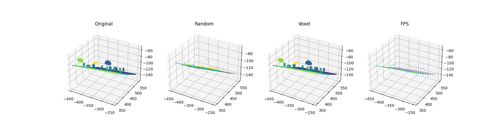

# Task 1b: Point Cloud Subsampling Suite

## Обзор проекта
Реализация и сравнительный анализ трех алгоритмов уменьшения плотности (subsampling) для крупномасштабных облаков точек на языке Python с использованием библиотеки NumPy. В качестве тестовых данных использован файл лазерного сканирования местности `terra_02_000004.asc`.

## Результаты визуализации
После обработки данных формируется сравнительный график, демонстрирующий работу алгоритмов при различных параметрах плотности.

---

## Аналитический отчет

### 1. Влияние размера выборки на визуальное качество
В ходе экспериментов установлено:
* **Увеличение выборки**: Позволяет достичь высокой детализации, объект выглядит «плавным» и связным.
* **Уменьшение выборки**: Ведет к деградации визуального качества. При критически малых значениях теряются мелкие геометрические признаки (ребра объектов, тонкие структуры), и облако превращается в набор разрозненных точек.

### 2. Влияние размера вокселя на детализацию
Метод `voxel_grid_subsampling` напрямую зависит от параметра `voxel_size`:
* **Малый размер вокселя**: Высокая точность передачи геометрии, близкая к оригиналу.
* **Большой размер вокселя**: Происходит сильная агрегация данных. Точки, попадающие в один куб, заменяются одной, что эффективно убирает шум, но сглаживает важные детали рельефа.

### 3. Сравнение методов по времени выполнения
Замеры проводились на стандартном наборе данных (N ≈ 1.2 млн точек).

| Метод | Временная сложность | Среднее время (сек) | Эффективность |
| :--- | :--- | :--- | :--- |
| **Random Subsampling** | $O(N)$ | 0.$O(N)$~0.005 | Экстремально высокая |
| **Voxel Grid** | $O(N)$ | ~0.200 | Высокая |
| **FPS (Farthest Point)** |$O(N*K)$  | ~120 | Низкая |

**Вывод:** Для задач реального времени предпочтительны Random или Voxel Grid. FPS целесообразно использовать только для небольших подмножеств точек, где критически важно покрытие.

### 4. Сравнение по сохранению геометрии

#### **Random Subsampling**
* **Плюсы**: Скорость, простота, сохранение общей статистики распределения.
* **Минусы**: Риск пропуска редких, но важных деталей; неравномерное покрытие.

#### **Voxel Grid Subsampling**
* **Плюсы**: Равномерная плотность на выходе, эффективное подавление шума.
* **Минусы**: Потеря деталей меньше размера вокселя, возможные искажения на тонких гранях.

#### **Farthest Point Sampling (FPS)**
* **Плюсы**: Идеальное пространственное покрытие, лучший метод для сохранения контуров и крайних точек объекта.
* **Минусы**: Требует огромных вычислительных затрат при увеличении числа точек $k$.

