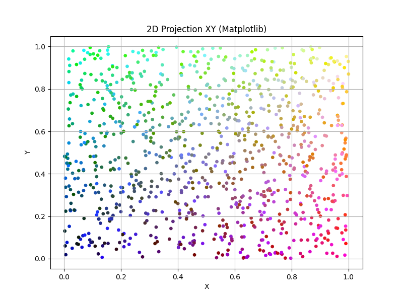
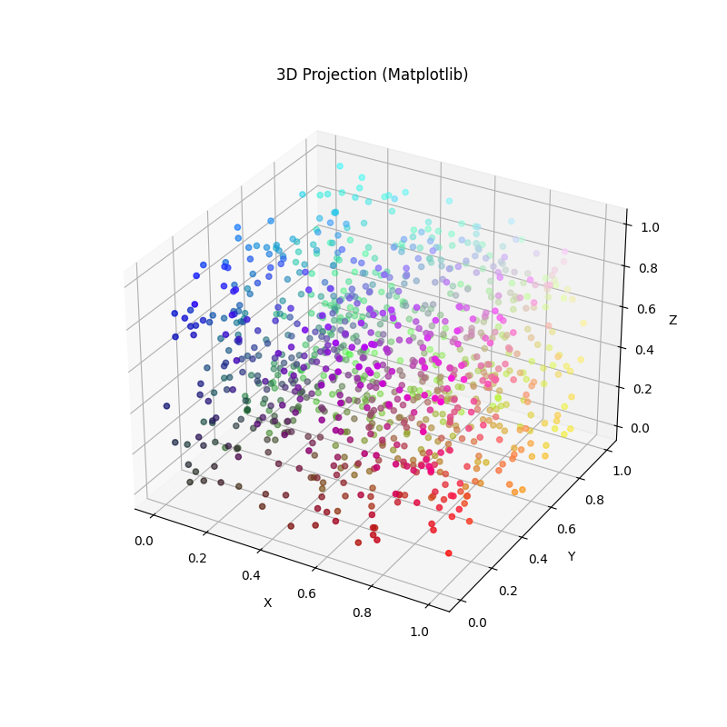
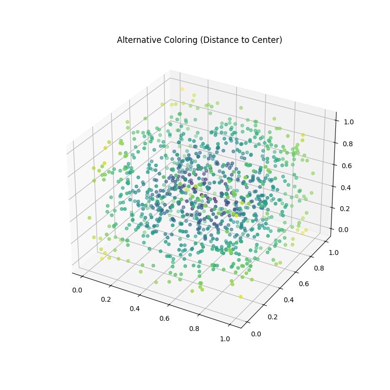

# Отчет по заданию: Визуализация и работа с цветом в облаках точек

## 1. Цель и задачи работы
**Цель:** Изучение методов визуализации 3D облаков точек с использованием цветового кодирования в Python.
**Задачи:**
* Генерация синтетического облака точек в кубе $[0, 1]^3$.
* Привязка каналов RGB к координатам XYZ.
* Сравнение инструментов Matplotlib и Plotly для отображения пространственных данных.
* Реализация альтернативной цветовой схемы на основе евклидова расстояния.

## 2. Теоретическая часть
* **Облако точек:** Дискретное представление геометрии объектов. В данной работе каждая точка описывается вектором $(x, y, z)$.
* **RGB Модель:** Цвет представляется как кортеж $(R, G, B)$. Значения нормализованы в диапазоне $[0, 1]$ для корректной обработки библиотеками Python.
* **Сравнение библиотек:** * **Matplotlib:** Оптимален для создания статичных 2D и 3D графиков для документации.
    * **Plotly:** Обеспечивает интерактивность, позволяя вращать сцену и изучать структуру облака изнутри.

## 3. Ход работы и результаты

### 3.1. 2D Визуализация (XY Проекция)
Отображение точек на плоскости, где цвет плавно меняется в зависимости от положения по осям X и Y.

### 3.2. Статическая 3D Визуализация
Построение "цветового куба", в котором каждый угол соответствует определенному чистому цвету (черный, красный, зеленый, синий, белый).

### 3.3. Альтернативная цветовая схема
Точки окрашены с использованием карты `viridis` в зависимости от расстояния до центра куба $(0.5, 0.5, 0.5)$.

---

## 4. Ответы на контрольные вопросы
1. **Диапазон RGB:** Использование 0-1 удобно для математических операций, тогда как 0-255 является стандартом хранения цвета в 8-битных изображениях.
2. **Задание цвета по скаляру:** Используется нормализация значения и применение `colormap` (цветовой карты), которая сопоставляет число с цветом градиента.
3. **Отличие визуализаций:** Matplotlib генерирует растровые/векторные изображения; Plotly создает интерактивный WebGL-объект.
4. **Цветовые карты:** В Matplotlib доступно множество карт (`plasma`, `inferno`, `coolwarm`), подключаемых через параметр `cmap`.
5. **Нормализация:** Без нее значения $>1$ будут интерпретироваться как белый цвет, а $<0$ как черный, что приведет к потере цветовой информации.

## 5. Выводы
В ходе работы освоены методы визуализации облаков точек. Выявлено, что интерактивные инструменты (Plotly) более эффективны для анализа сложных 3D-сцен, тогда как статичные (Matplotlib) лучше подходят для подготовки печатных отчетов. Полученные навыки применимы в задачах классификации LiDAR-данных и анализе научной графики.
