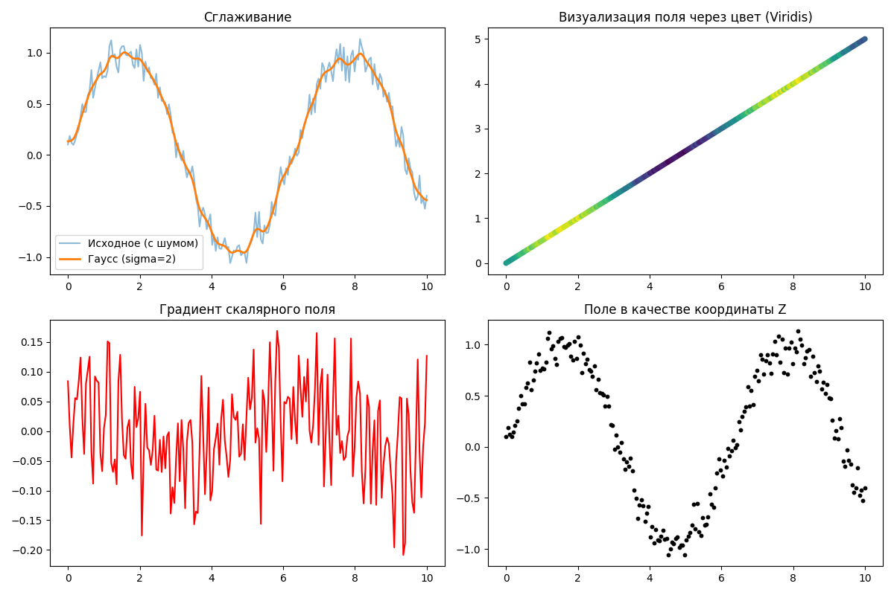

---

## 1. Цель работы
Изучить методы программного управления скалярными величинами, привязанными к 3D-координатам. Освоить математические операции, фильтрацию, сглаживание и интерполяцию данных с использованием библиотек NumPy и SciPy.

---

## 2. Исходные данные
* **Облако точек:** Синтетическое облако из 200 точек ($N=200$), представляющее линейный профиль.
* **Скалярное поле:** Зашумленная синусоидальная функция, имитирующая данные с датчика (например, интенсивность или температуру).

---

## 3. Ход работы (Выполнение заданий 1–13)

### Задание 1. Добавление постоянного значения
С помощью функции `np.full()` создан массив значений **10.0** для всего облака точек. Это позволяет задавать базовые пороги или калибровочные константы.

### Задание 2. Умножение на число
Скалярное поле было умножено на **2**. Операция применяется для нормализации уровней сигнала или изменения масштаба величин.

### Задание 3. Сложение с числом
К полю добавлена константа **5**. Это используется для корректировки систематической ошибки (bias) измерений.

### Задание 4. Гауссов фильтр (сглаживание)
Применен фильтр `gaussian_filter1d` с $\sigma=2$. Это позволило подавить высокочастотный шум, сохранив при этом общую структуру полезного сигнала.

### Задание 5. Вычисление градиента
Использована функция `np.gradient()`. Она вычисляет скорость изменения поля, что необходимо для поиска границ объектов или детекции аномалий.

### Задание 6. Скользящее среднее
Реализовано через свертку (`np.convolve`). Данный метод сглаживания эффективно усредняет локальные выбросы в данных.

### Задание 7. Преобразование в RGB цвета
Скалярные значения сопоставлены с цветовой картой `viridis`. Точки с минимальными значениями окрашены в фиолетовый, с максимальными — в желтый.

### Задание 8. Статистические параметры
С помощью методов NumPy получены следующие метрики поля (примерные значения):
| Среднее значение | 0.19504409404749964 |
| Стандартное отклонение |0.6643678010807909 |
| Минимум | -1.059032727789679|
| Максимум | 1.134806329645993 |

### Задание 9. Нормализация в диапазон [0, 1]
Данные масштабированы по формуле $(x - min) / (max - min)$. Это обязательный этап перед визуализацией и подачей данных в модели машинного обучения.

### Задание 10. Интерполяция (заполнение пропусков)
В данных был создан искусственный разрыв (NaN). С помощью `scipy.interpolate.interp1d` пропущенный сегмент был восстановлен линейным методом.

### Задание 11. Фильтрация по значению
Произведена сегментация облака точек: выделено подмножество точек, чьи значения скалярного поля находятся в диапазоне $[0.5, 1.0]$.

### Задание 12. Поле как координата Z
Произведена замена оригинальной координаты Z значениями скалярного поля. Это позволило визуально оценить динамику изменения поля как физического рельефа.

### Задание 13. Удаление поля
Объект `scalar_field` удален из оперативной памяти (`del`), что демонстрирует корректное управление ресурсами при работе с большими массивами данных.

---

## 4. Визуализация результатов

На графиках ниже представлены результаты интерполяции, сегментации и визуализации поля через геометрическую координату:

---

## 5. Ответы на контрольные вопросы

1. **Что такое скалярное поле?** Это числовая характеристика, присвоенная каждой точке пространства (например, плотность, высота или отражательная способность).
2. **Зачем нужен гауссов фильтр?** Для фильтрации "белого шума", возникающего из-за несовершенства сенсоров (лидаров, камер).
3. **Что такое нормализация?** Приведение значений к стандартному диапазону (обычно 0–1) для корректной работы алгоритмов и цветовых карт.
4. **Зачем менять Z на скалярное поле?** Для наглядного поиска пространственных аномалий и выбросов, которые сложно заметить в табличном виде.

* **Фильтрация:** Позволяет сегментировать облако (например, выделить только объекты с высокой интенсивностью отражения).

## 5. Вывод
В ходе работы были изучены все ключевые этапы жизненного цикла скалярного поля: от генерации и арифметической обработки до фильтрации, интерполяции и удаления. Эти методы лежат в основе анализа данных дистанционного зондирования и топографии.
